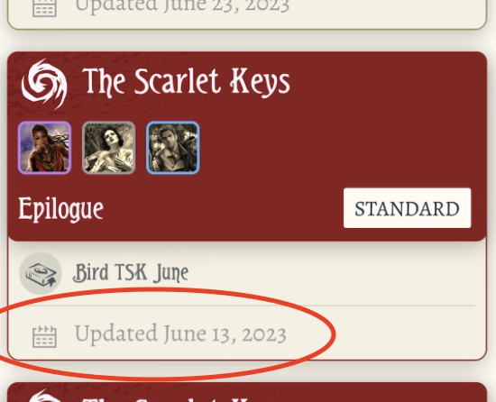

Optional. For some groups, a campaign might take months to finish. The finish date can identify the campaign better than the start date.

Just the start or finish date alone can help identify what you played in what years. If the start and finish dates span across years, the start date is prioritized as the year you played it.

It is ideal if both start and finish dates are provided. Searching your archive for a specific date will then hit any date between start and finish. It also helps a calendar-like widget to show how long it took to finish the campaign, accounting for all the off days in between.

## Where to find it in ArkhamCards

When you look at older archived campaign, this "last modified date" here is your Finish Date. **Make sure to not accidentally modify anything in this campaign, or you will permanently lose this date!**
